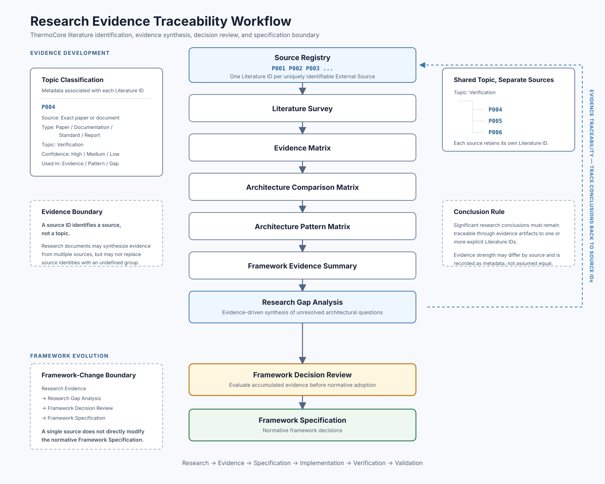

# Research Evidence Traceability Workflow

## Figure Purpose

This figure documents the ThermoCore literature-identification and evidence-traceability workflow. It shows how uniquely identifiable external sources enter the Source Registry, move through research synthesis artifacts, support Research Gap Analysis, and inform Framework Specification only after Framework Decision Review.

The figure describes research governance and evidence flow. It does not introduce research findings or prescribe an implementation backend.

## Literature ID Rule

One Literature ID corresponds to exactly one uniquely identifiable source. A source may be a research paper, official framework document, technical report, standard, book or book chapter, or an independently citable survey document.

Placeholder identifiers such as `P001`, `P002`, and `P003` demonstrate the identification system. They do not assign final identifiers to unconfirmed sources. Literature IDs are preserved throughout the evidence chain so that later analyses can identify their supporting sources.

## Topic Versus Source

Topic Classification is metadata associated with a Literature ID; it is not a replacement for source identity. Multiple sources may share a topic, but every source retains its own Literature ID.

For example, a Verification topic may classify `P004`, `P005`, and `P006`. It must not receive one Literature ID unless the identified item is itself one independently identifiable and citable survey or review source.

> A source ID identifies a source, not a topic.

Research documents may synthesize evidence from multiple sources, but they may not replace individual source identities with an undefined literature group. Evidence-strength metadata, including confidence, also prevents the workflow from implying that every source has equal evidential strength.

## Evidence Traceability

Evidence Traceability operates across the complete research chain:

`Source Registry → Literature Survey → Evidence Matrix → Architecture Comparison Matrix → Architecture Pattern Matrix → Framework Evidence Summary → Research Gap Analysis`

Each significant research conclusion must be traceable backward through these artifacts to one or more explicit Literature IDs. Comparison and synthesis documents may combine evidence, but their conclusions remain connected to the underlying source records.

## Framework-Change Boundary

Research findings do not directly modify the Framework. The required transition is:

`Research Evidence → Research Gap Analysis → Framework Decision Review → Framework Specification`

Framework Decision Review separates descriptive research analysis from normative specification. A single new source therefore cannot directly establish or change a Framework requirement. Candidate findings must be evaluated with the accumulated evidence before they are adopted as framework decisions.

## Figure

