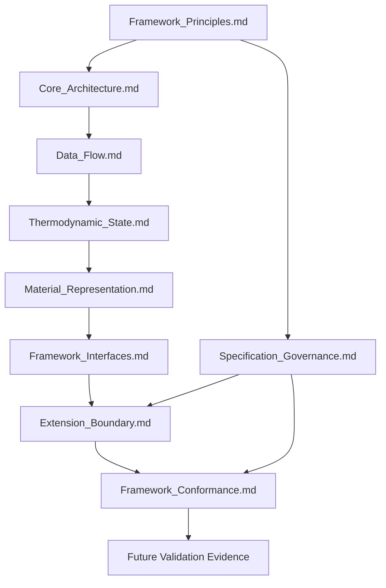
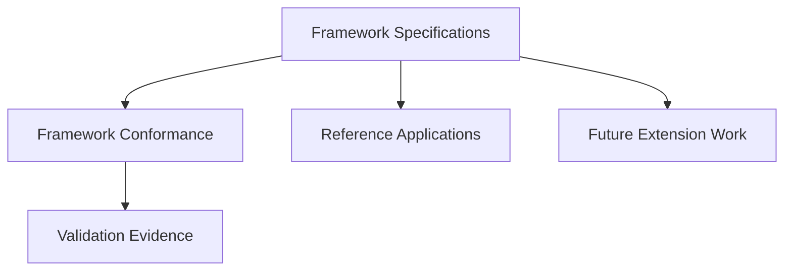

# Specification Index

Version: 1.0  
Status: Informational Navigation Document

---

## 1. Purpose

This document is the official navigation guide for the ThermoCore Framework Specification System.

It identifies the purpose, primary responsibility, normative dependencies, and recommended reading order of each Framework Specification. It also explains how the specification system relates to Framework Vocabulary, Validation, Reference Applications, and future extensions.

This document does not define Framework behavior, requirements, terminology, architecture, ownership, Conformance, or Governance. Authority remains with the applicable Framework Specifications.

## 2. Framework Specification Hierarchy

The diagram presents the principal refinement path, the cross-cutting Governance path, and the downstream dependency of Validation Evidence on Framework Conformance. It represents conceptual dependency relationships only. It does not define execution order, implementation flow, document authority beyond the named dependencies, or a runtime pipeline.

Many later specifications depend cumulatively on more than the immediately preceding document. The complete normative dependencies are listed in Section 3.

## 3. Specification Overview

| Specification | Primary Responsibility | Depends On |
|---|---|---|
| [`Framework_Principles.md`](Framework_Specification/Framework_Principles.md) | Defines the Root Specification, highest-level architectural principles, scope, and framework identity. | None |
| [`Core_Architecture.md`](Framework_Specification/Core_Architecture.md) | Defines the normative architectural decomposition, component responsibilities, ownership, boundaries, and invariants. | `Framework_Principles.md` |
| [`Data_Flow.md`](Framework_Specification/Data_Flow.md) | Defines Runtime Information Flow, Configuration Information Flow, information ownership, relationship semantics, and flow constraints. | `Framework_Principles.md`; `Core_Architecture.md` |
| [`Thermodynamic_State.md`](Framework_Specification/Thermodynamic_State.md) | Defines the semantics, ownership, classification, lifecycle, and constraints of Thermodynamic State as Runtime State. | `Framework_Principles.md`; `Core_Architecture.md`; `Data_Flow.md` |
| [`Material_Representation.md`](Framework_Specification/Material_Representation.md) | Defines the semantics, responsibility, ownership, classification, lifecycle, and interpretation principles of Material Representation and Representation. | `Framework_Principles.md`; `Core_Architecture.md`; `Data_Flow.md`; `Thermodynamic_State.md` |
| [`Framework_Interfaces.md`](Framework_Specification/Framework_Interfaces.md) | Defines the communication semantics, responsibilities, boundaries, ownership preservation, and constraints of Framework Interfaces. | `Framework_Principles.md`; `Core_Architecture.md`; `Data_Flow.md`; `Thermodynamic_State.md`; `Material_Representation.md` |
| [`Extension_Boundary.md`](Framework_Specification/Extension_Boundary.md) | Defines Extension Module semantics, optionality, ownership, Communication boundaries, and extension constraints. | `Framework_Principles.md`; `Core_Architecture.md`; `Data_Flow.md`; `Thermodynamic_State.md`; `Material_Representation.md`; `Framework_Interfaces.md`; `Specification_Governance.md` |
| [`Framework_Conformance.md`](Framework_Specification/Framework_Conformance.md) | Defines the semantics by which satisfaction of applicable normative requirements constitutes Framework Conformance. | `Framework_Principles.md`; `Core_Architecture.md`; `Data_Flow.md`; `Thermodynamic_State.md`; `Material_Representation.md`; `Framework_Interfaces.md`; `Extension_Boundary.md`; `Specification_Governance.md` |
| [`Specification_Governance.md`](Framework_Specification/Specification_Governance.md) | Defines cross-specification Governance for dependency, semantic preservation, ownership, architecture, information, scope, and documentation consistency. | `Framework_Principles.md` |

The table reports the explicit Normative Dependencies declared by each specification. A dependency does not transfer Definition Ownership or permit a child specification to redefine its parent.

## 4. Recommended Reading Order

For an architectural reading of the Framework Specification System, use the following order:

1. [`Framework_Principles.md`](Framework_Specification/Framework_Principles.md)
2. [`Core_Architecture.md`](Framework_Specification/Core_Architecture.md)
3. [`Data_Flow.md`](Framework_Specification/Data_Flow.md)
4. [`Thermodynamic_State.md`](Framework_Specification/Thermodynamic_State.md)
5. [`Material_Representation.md`](Framework_Specification/Material_Representation.md)
6. [`Framework_Interfaces.md`](Framework_Specification/Framework_Interfaces.md)
7. [`Extension_Boundary.md`](Framework_Specification/Extension_Boundary.md)
8. [`Framework_Conformance.md`](Framework_Specification/Framework_Conformance.md)

Read [`Specification_Governance.md`](Framework_Specification/Specification_Governance.md) as the cross-cutting Governance document. It derives from the Root Specification and governs consistency across the specification set. It is especially relevant when reading or maintaining `Extension_Boundary.md`, `Framework_Conformance.md`, or any future Framework Specification.

[`Framework_Vocabulary.md`](Framework_Vocabulary.md) may be referenced throughout the reading sequence whenever authoritative terminology, Definition Ownership, or first introduction history must be identified.

The recommended reading order aids comprehension. It does not replace or alter the explicit Normative Dependencies listed in Section 3.

## 5. Relationship to Validation

Framework Specifications define normative requirements.

[`Framework_Conformance.md`](Framework_Specification/Framework_Conformance.md) defines the semantics by which an implementation is determined to conform to those requirements.

Validation provides evidence relevant to the applicable Framework Specifications and Framework Conformance. Validation Evidence supports a Conformance determination; it does not define, replace, or modify the normative requirements or Conformance semantics.

The applicable authoritative Framework Specifications require future Validation documents to reference the relevant specifications and identify the requirements or Conformance concerns for which evidence is provided. No `Validation/` directory is represented here as a currently published artifact.

Verification and Validation remain distinct activities as established by `Framework_Principles.md` and indexed by `Framework_Vocabulary.md`.

## 6. Relationship to Vocabulary

[`Framework_Vocabulary.md`](Framework_Vocabulary.md) provides the authoritative terminology index for the ThermoCore Framework Specification System.

It complements this Specification Index:

- the Specification Index identifies documents, responsibilities, dependencies, and reading order;
- the Framework Vocabulary identifies normative terms, Definition Owners, Primary Specifications, and where terms were first introduced.

The Framework Vocabulary does not redefine terminology. Each Primary Specification remains authoritative for the semantics assigned to it.

## 7. Specification Evolution

The following diagram shows how the Framework Specification System supports later evidence, applications, and extension work:

This diagram is informational. It shows non-linear relationships among specifications, Conformance, evidence, applications, and extension work. It does not define a normative dependency graph, execution sequence, maturity requirement, mandatory workflow, or release pipeline.

Framework Specifications are the normative basis for subsequent work. Framework Conformance defines how satisfaction of applicable requirements is determined. Validation Evidence may support that determination. Reference Applications and future extension work relate directly to the Framework Specifications without depending on completion of one another.

Demo and Sandbox artifacts are Reference Applications. They may demonstrate, exercise, or consume a conforming implementation, but they do not define Framework behavior or Framework Conformance.

The authoritative requirements for evaluating future capabilities against existing Core and Extension boundaries are defined by [`Extension_Boundary.md`](Framework_Specification/Extension_Boundary.md) and [`Specification_Governance.md`](Framework_Specification/Specification_Governance.md). This index does not create additional extension or specification-change requirements.

## 8. Document Status

This document is an informational navigation document for the ThermoCore Framework Specification System.

It is not a normative specification. It introduces no requirement, terminology, implementation detail, architecture, ownership assignment, Conformance semantic, Governance rule, or extension policy.

If this document conflicts with a Framework Specification, the applicable Framework Specification is authoritative.
